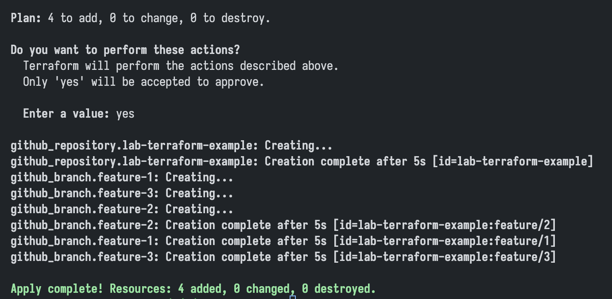
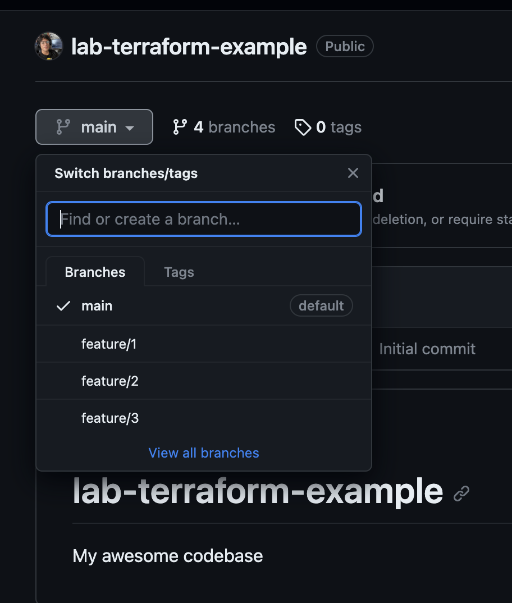

# Lab Infrastructure as Code Terraform

## Author

### Gabriel Andres Anzola Tachak (ganzola)

## General Context

The GitHub provider is used to interact with GitHub resources. The provider
allows you to manage your GitHub organization's members and teams easily. It
needs to be configured with the proper credentials before it can be used. Use
the navigation to the left to read about the available resources.

## Evidence

## Created Repository URL

<https://github.com/ganzola/lab-terraform-example>

